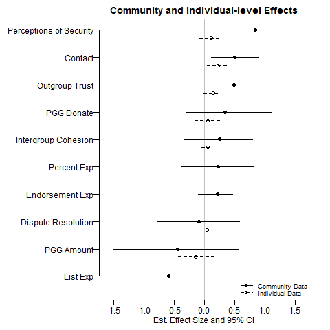

```{r setup, include=FALSE}
knitr::opts_chunk$set(echo = TRUE)
```


## Results Outline

## Results

# Results

**Sig Increase**: Trust, Security, Contact self-report & observed in markets

**Increase**: Intergroup empathy, some affect survey exps

**Nothing**: Ingroup expansion, observed contact at social events, Dispute resolution index, threat.

**Decrease**: Cooperation in PGG, List Exp.




*******

## Placebo Outcomes

Could be social desirability bias -- respondents in treatment villages learned what the enumerators and NGO wanted to hear.  If so, we should expect effects for dispute resolution, intergroup cohesion, PGG, etc...which we do not see.  Would also expect effects for _the acceptability of violence_.  We measured acceptability of violence with a 5 question index.


## Limitations

### Small Number of Communities 

The main limitation of the community-level randomized controlled trial is the number of communities we were able to include in the study. With 30 communities clustered at 15 sites, we have relatively low power to detect an effect of ECPN. We try to increase power by testing multiple hypotheses simultaneously (following Caughey, Dafoe, and Seawright 2017) and by using inverse-covariance-weighted outcome indices,  which should measure our outcomes of interest more precisely than indices constructed using other methods.

### Self-Selection at the Individual Level 

We also initially planned to randomize participation on ECPN committees within intervention communities. However, as discussed above, we had low compliance with the individual-level randomization. As a result, many of the people on the committees self-selected into participation. If we see positive change among committee participants, therefore, it is possible that the type of people who participated would have changed more positively even without ECPN, making it difficult to attribute the change to ECPN. It is also possible that ECPN is effective only on the type of people who elected to participate and would not be as effective on people less interested in the program, making it difficult to generalize the effects of ECPN to the wider population in these areas.

We try to address these concerns in three ways. First, we illustrate that the respondents we resurveyed are not statistically different from baseline respondents on baseline measures. Since the people we resurveyed are an as-if-random sample of all baseline respondents, effects we see in this sample should generalize to other respondents. Second, we demonstrate that on most measures, there are no measurable baseline differences between direct participants, indirect participants, and controls. When there are differences, the control sites start out more positively than intervention sites, which would make it more difficult for us to see an effect (i.e., the differences work against us). Third, we present evidence that these groups do not differ in their baseline-to-endline changes on two placebo outcomes,  suggesting that they have similar trajectories in the absence of ECPN. The results of these balance and placebo tests are presented in Appendix 4. 

### Displacement

 additional limitation of both analyses was the significant displacement in Benue state at the time of the endline. Widespread violence between farmers and pastoralists had forced many of the communities in Benue to flee to safer locations. While we chose randomly among the people we could find, we do not know whether the community members we could locate were somehow different from the broader population in these communities.  Appendix 1 presents evidence that on measured variables, resurveyed respondents in the individual-level analysis are representative of all people from the baseline; we are not able to conduct a similar analysis with the community-level sample. In the discussion section, we provide further explanations for how the interpretation of our results would change if our sample is unrepresentative due to displacement. 

### Program Adaptations

Finally, due to the fluid nature of conflict dynamics and the need to adapt the program when necessary, we were not able to maintain separation between intervention and control sites (i.e., there was contamination). For example, the team conducted an intercommunity peace forum in one intervention site, but community leaders requested that leaders from a neighboring site—which happened to be a control site—attend the forum because of a recent conflict event that had spread across the area. The program team decided to risk contamination of the research by including the control site in that one forum, for the sake of the program’s success. This type of contamination was limited as much as possible, and to the extent that it may affect results of the study, it would attenuate the results, working against our hypotheses rather than in favor of them. 


<!--
# Scacco

-->